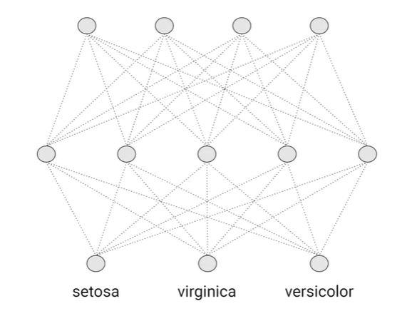

# Introduction to TensorFlow.js

## Training and Inference using TensorFlow.js in Javascript

How do you take that model and have it be running 24/7, have it serve actual user queries, and create value? Yes, by deploying the model.

TensorFlow allows you to do neural network training and inference right there in your web browser without needing to send that image up to the cloud to be processed by a server. So, you're going to save time on the round tripping or if in a scenario if you're doing it on mobile for example that you don't even need to be connected. 

### Getting the System Ready
* Internet browser: Chrome
* HTML editor: [Brackets](https://brackets.io/) / Visual Studio Code
* Web Server: [Web Server for Chrome App](https://chrome.google.com/webstore/detail/web-server-for-chrome/ofhbbkphhbklhfoeikjpcbhemlocgigb/related?hl=en)

### TensorFlow.js
<p align="center">
     <br>
    <i>Images 1 Design and architecture of TensorFlow.js</i>
</p>

The goal is twofold. First, we want to make it easy for you to code against it with a friendly high-level API, but you can also go lower into the APIs and program against them directly too. It's designed to run in the browser as well as an Node.js server.
* Layers API, at this point we've been programming convolutional neural networks and deep neural networks using the Keras API in TensorFlow.
* Core API, the low-level APIs. They're designed to work with a TensorFlow saved model formats, which in TensorFlow 2.0 is designed to be a standard file format which can be used across the Python APIs, the JavaScript ones, and even TensorFlow Lite for mobile and embedded devices.
    * The Core API then works with the **browser** and can take advantage of **WebGL** for accelerated training and inference.
    * On **Node.js**, you can build server-side or terminal applications using it. These can then take advantage of **CPUs, GPUs, and TPUs** depending on what's available to your machine.

### Building the Model
```javascript
<script lang="js">
    const model = tf.sequential();
    model.add(tf.layers.dense({units: 1, inputShape: [1]}));
    model.compile({loss: 'meanSquaredError',
    optimizer: 'sgd'});
    model.summary();

    const xs = tf.tensor2d([-1.0, 0.0, 1.0, 2.0, 3.0, 4.0], [6, 1]);
    const ys = tf.tensor2d([-3.0, -1.0, 2.0, 3.0, 5.0, 7.0], [6, 1]);
 
</script>
```

In Python we were able to use a NumPy array but we don't have NumPy in JavaScript, so we're going a little lower. As its name suggests, when using a ``Tensor 2D``, you have a two dimensional array or two one-dimensional arrays.

As its name suggests, when using a Tensor 2D, you have a two dimensional array or two one-dimensional arrays.

### Training the Model
Training should be an asynchronous function because it will take an indeterminate time to complete. 
```javascript
 doTraining(model).then(() => {
        alert(model.predict(tf.tensor2d([10], [1,1])));
    })
```

<p align="center">
     <br>
    <i>Images 2 Training Model</i>
</p>

* model.fit() is the function to do the training

## Training Models with CSV Files
One of the most common ways of getting data into an ML model and JavaScript ones are no exception, is in reading data from CSV files. 

### Reading the Data
```javascript
async function run()
```

It has to be asynchronous becasue we will be awaiting some values for example when we're training. To load the data from the CSV, you'll use code like this. 

```javascript
const csvUrl = 'iris.csv';
const trainingData = tf.data.csv(csvUrl, {
    columnConfigs: {
        species: {
            isLabel: true
        }
    }
});
```

It uses the tf.data.csv class to handle loading and parsing the data. There are a number of things you'll need to pay attention to.
* The CSV is at a URL. I don't have the server or protocol details, which means it's going to try to load it from the same directory as the web page it's hosting it. But it's important to note that it isn't loading from the file system directly. It's going through the HTTP stack to get the file, so you'll need to run this code on a web server. Brackets IDE has a built-in web server.
* ``tf.data.csv`` takes care of CSV management
* Tensorflow doesn't know from this file what your features or labels are so you have to at least flag, which column should be treated as label

```javascript
const convertedData = trainingData.map(({xs, ys}) => {
    const labels = [
        ys.species == "setosa" ? 1 : 0,
        ys.species == "virginica" ? 1 : 0,
        ys.species == "versicolor" ? 1 : 0
    ];

    return({ xs: Object.values(xs), ys: Object.values(ys.diagnosis)});
}).batch(10);
```

The data comes back from tf.data.csv as dictionaries, and for training we want to convert it into arrays. We also want to convert the strings defined in the labels into a one hot encoded array of label values. To do this we call the map method on the dictionary and tell it that we want sets of x's and y's back like this.

### One-hot Encoding
<p align="center">
     <br>
    <i>Images 3 One Hot Encoding</i>
</p>

If we feed labels into the neural network when training it that represent the desired outputs, we would encode them in the representation that we would like to see in the outputs and that's one-hot encoding, i.e. one of the values in the array is the hot value.

### Designing the Neural Network

<p align="center">
     <br>
    <i>Images 4 Designing Neural Network</i>
</p>

 At the top are the four features, in the middle is a hidden layer with five nodes, and at the bottom are the three nodes that we'll use for the classification.

 ```javascript
const model = tf.sequential();

model.add(tf.layers.dense({
    inputShape: [numofFeatures], // Flatten in python
    activation: "sigmoid", units: 5 // hidden layer with 5 neurons
}));

model.add(tf.layers.dense({activation: "softmax", units: 3})); // bottom layer

model.compile({
    loss: "categoricalCrossentropy".
    optimizer: tf.train.adam(0.06)
});

// do the training
await model.fitDataset(
    convertedData // passing data,
    {
        epochs: 100,
        callbacks: {
            onEpochEnd: async(epoch, logs) => {
                console.log("E: " + epoch + " loss: " + logs.loss);
            }
        }
    }
);

// to inference and get prediction
const testVal = tf.tensor2d([5.8, 2.7, 5.1, 1.9], [1, 4]);
const prediction = model.predict(testVal);
alert(prediction);
```

## Iris Classifier

We will create a neural network that can classify the 3 types of Iris plants found in the Iris dataset. Open [C1_W1_Lab_2_iris_classifier.html](../../tensorflow-2-public/C1_Browser-based-TF-JS/W1/ungraded_labs/C1_W1_Lab_2_iris_classifier.html) file.

When launching the C1_W1_Lab_2_iris_classifier.html  file in Chrome browser, make sure to open Developer Tools to see the output in the Console. After training has finished, the code will alert the name of the predicted Iris plant. In this particular example, the predicted Iris plant is a Setosa.

<p align="center">
     <br>
</p>

## References
* GitHub repository: https://github.com/https-deeplearning-ai/tensorflow-2-public
* Iris Dataset Documentation: https://archive.ics.uci.edu/ml/datasets/iris
* Lecture Notes: https://community.deeplearning.ai/t/tf-data-and-deployment-course-1-lecture-notes/61289