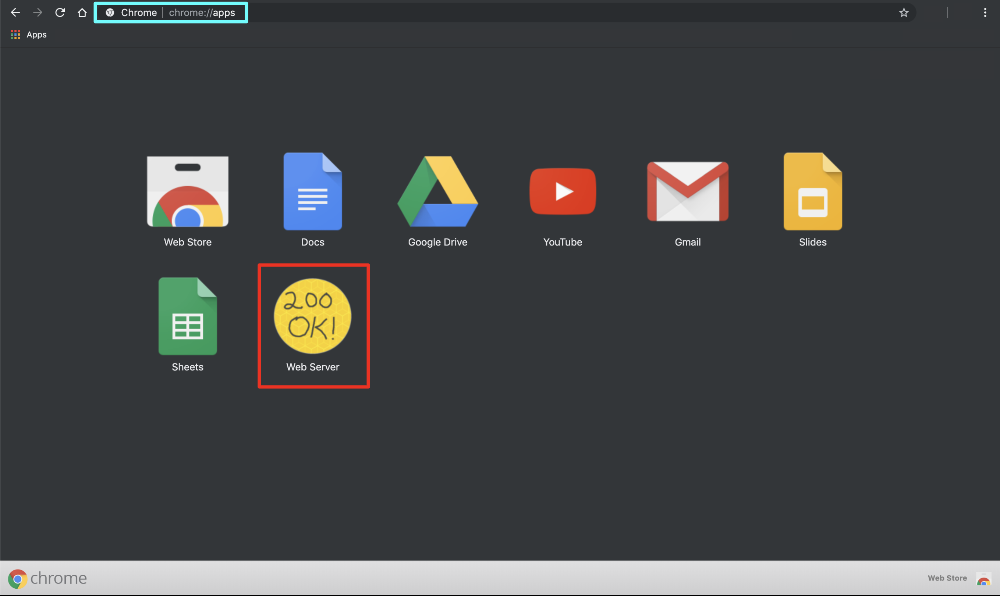
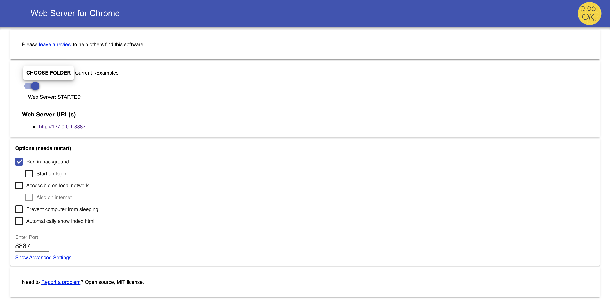
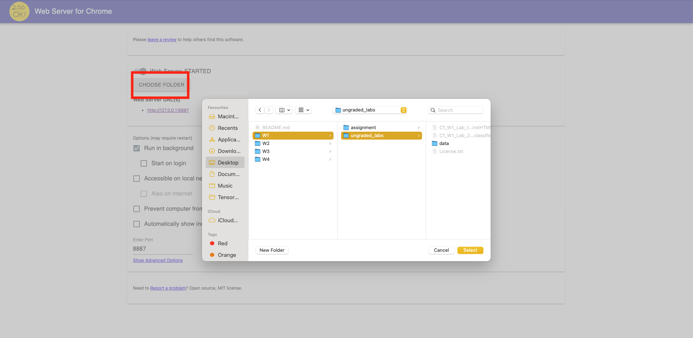
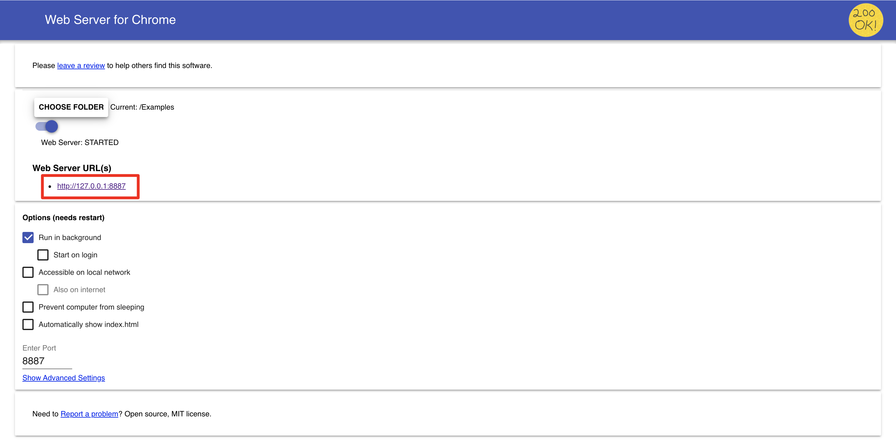
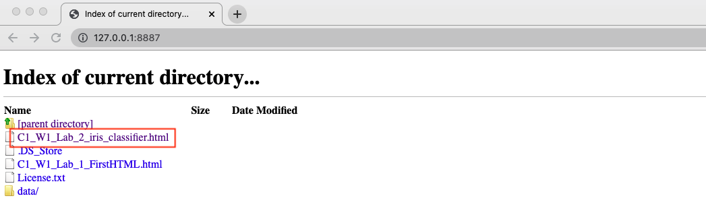

# Using the Web Server

For the remaining examples and exercises in this course you will need to run a web server locally on your machine. This is because in javascript every call has to be done through and HTTP request. Therefore, even if you  have your files locally, you can't just load them directly, you have to make an HTTP request to those files. This is what the Web Server for Chrome App is used for. 

1. Open the Chrome browser and go to the Chrome apps (chrome://apps/):
    <p align="center">
         <br>
    </p>
2. Click on the Web Server icon to launch it.
    <p align="center">
         <br>
    </p>
3. Click on "CHOOSE FOLDER" and select the folder that contains the ungraded lab(s) or programming assignment you want to run. For this example, we are going to run the [C1_W1_Lab_2_iris_classifier.html](../../tensorflow-2-public/C1_Browser-based-TF-JS/W1/ungraded_labs/C1_W1_Lab_2_iris_classifier.html) file. On my computer, this file is located in the following folder:

    ```tensorflow-2-public/C1_Browser-based-TF-JS/W1/ungraded_labs/```

    Therefore, I will select that folder.
    <p align="center">
         <br>
    </p>
4. Once you have chosen the correct folder, you can click on the Web Server URL (http://127.0.0.1:8887). 
    <p align="center">
         <br>
    </p>
5. Once you click on the Web Server URL, this will open a new tab in your Chrome browser (if Chrome is your default browser). You can now click on the html file you want to run. In this case, we are going to run the [C1_W1_Lab_2_iris_classifier.html](../../tensorflow-2-public/C1_Browser-based-TF-JS/W1/ungraded_labs/C1_W1_Lab_2_iris_classifier.html) file.
   <p align="center">
         <br>
    </p>