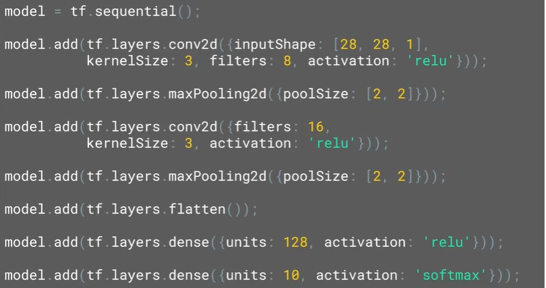
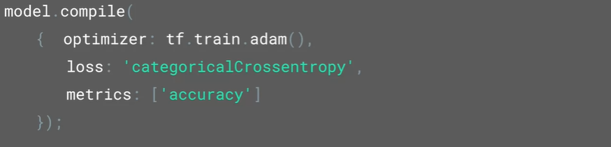
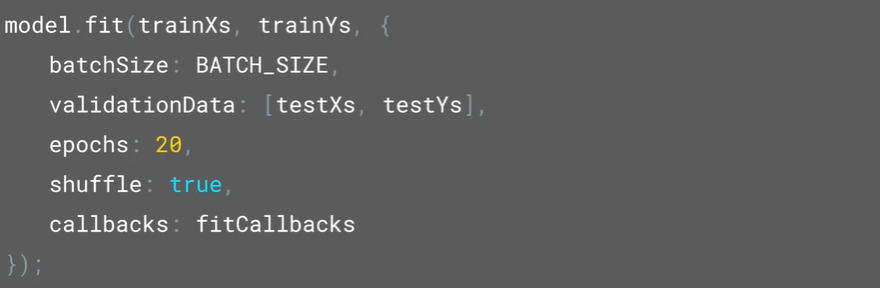
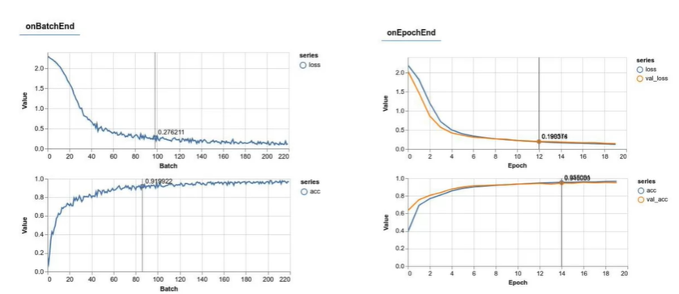
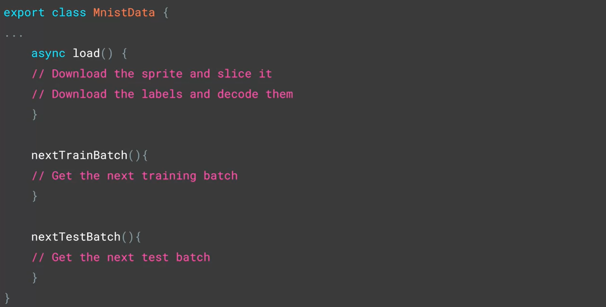
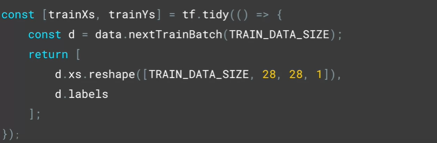

# Image Classification in The Browser

Unlike training in a Python where you can download 10,000 images, one after another, you can't do that in a web browser. Exactly. So there's a little trick that gamers actually use and game developers use where you combine all the images into a spritesheet. So you have one big spritesheet that you download and then slice that up in memory and do the training off of that.

## Creating a Convolutional Net with Javascript

<p align="center">
     <br>
    <i>Images 1 CNN in Javascript</i>
</p>

Here are the explanation of the code above:
* ``model = tf.sequential()`` means that it will be a sequence of layers
* First layer in a 2D conv, which is defined in ``tf.layers.conv2d``
  * To define the size of the convolutional filter, we'll use the kernel size property. By setting it to three, we are specifying that we want to use three by three filters
  * Activation function is ReLu to filter out values that are less than 0
* Next layer is a MaxPooling 2D, it's a two-by-two pool
* Then we'll have another convolutional layer, this time would 16 filters. This will be followed by another max pool. When we're training, our data will be in chunks of 5500 images at a time loaded in as an array of 5500 28 by 28 images with 10 labels.
* Flatten here we'll take the 28 by 28 pixels for each and flatten them out where they will then be fed into a dense layer with a 128 neurons, which will attempt to figure out a pattern between the learned convolutions and the labels.
* With a final layer of 10 units activated by softmax, that will provide the output classification given that we have ten labels in the data-set.

<p align="center">
     <br>
    <i>Images 2 Model Compile</i>
</p>

Something to note in compiling the model, parameters are passed in using a Javascript dictionary hence the braces. 

<p align="center">
     <br>
    <i>Images 3 Model Training</i>
</p>

Batching data for training instead of flooding the model with all of the data at once, it trains using a subset and then again with another subset, etc., is always a good idea. When doing it in the browser it's an even better idea so you don't lock up the browser itself. So you can set the batch size with this parameter. 

If you want to shuffle the data to help randomize it for training, preventing potential over-fitting if multiple similar classes are in the same batch, then you can specify the shuffle option like this: ```shuffle: true```

### **Visualizing the Training Process**

In JavaScript there's some extra tools that you can use to make visualization of the training a lot more friendly. First of all, include the library called tfjs-vis in your code with this script. 
```javascript
<script src="https://cdn.jsdelivr.net/npm/@tensorflow/tfjs-vis"></script>
```

In model.fit, there's a dictionary of parameters for the training including the callbacks which in this case is configured to point to an object called **fitCallbacks**.

```javascript
const metrics = ['loss', 'val_loss', 'acc', 'val_acc'];
const container = { name: 'Model Training',  styles: { height: '1000px' }};
const fitCallbacks = tfvis.show.fitCallbacks(container, metrics);
```

For the container, we just set a name and any required styles, and the visualization library will create the DOM elements to render the details. When we're training, the callback will create a container in which it will draw the feedback depending on the metrics that you select.

<p align="center">
     <br>
    <i>Images 4 Training Visualization</i>
</p>

### **What Is a Sprite Sheet**
A sprite sheet is a bitmap image file that contains several smaller graphics in a tiled grid arrangement. By compiling several graphics into a single file, you enable Animate and other applications to use the graphics while only needing to load a single file.

<p align="center">
     <br>
    <i>Images 5 Load MNIST Image</i>
</p>

* The job of the load method is to download the sprite sheet, and labels, and decode them along with a helper function called next batch, which is used to batch them according to the specified train and test batch sizes. 
* The other methods are next train batch which gets the next batch of training data i.e. slices off the image according to the desired batch size. Note that it keeps them as one by 784 pixels and the calling function can then resize them to 28 by 28.

To initialize the data class and load the sprite:
```javascript
const data = new MnistData();
await data.load();
```

Get the batches and resize them to the desired to 28 by 28 like this.

<p align="center">
     <br>
    <i>Images 6 Get and Resize Batches</i>
</p>

## MNIST Classifier
### **Using tf.tidy() to Save Memory**

TensorFlow apps, by their nature, tend to use a lot of memory. Here for example, we've allocated in memory of 5,500 times 28 times 28 tensor. So the idea of tf.tidy is that once the execution is done, it cleans up all those intermediate tensors, except those that it returns. So in this case d gets cleaned up after we're done and it saves us a lot of memory.

## References
* tfjs-vis: https://github.com/tensorflow/tfjs-vis
* MNIS spritesheet: https://github.com/https-deeplearning-ai/tensorflow-2-public/blob/main/C1_Browser-based-TF-JS/Misc/mnist_images.png