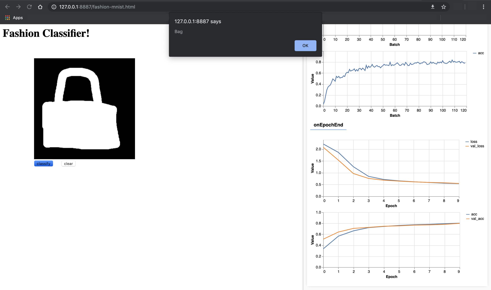
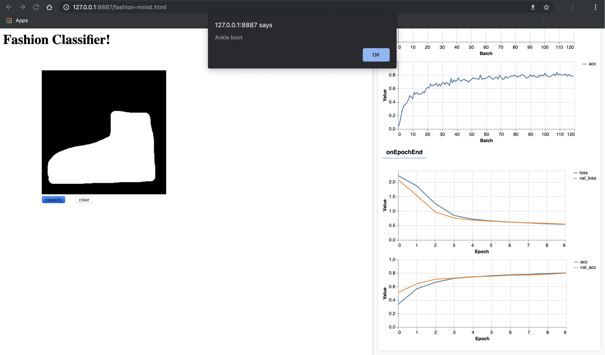
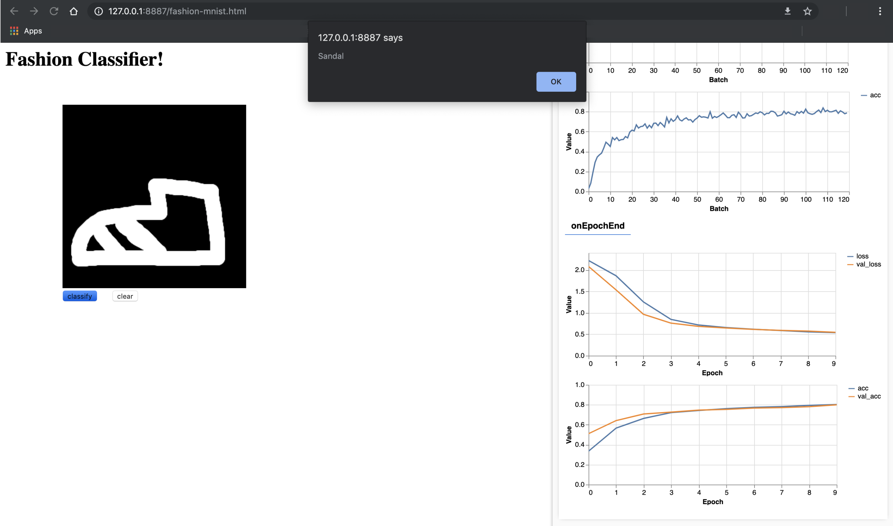

# Fashion MNIST Classifier

In this week's exercise, you will try to build and train a neural network that can classify the images in the Fashion MNIST dataset.  You can use Brackets to open the C1_W2_Assignment.js file and take a look at the code. You can find the C1_W2_Assignment.js file in the following folder in the GitHub repository for this course:

[tensorflow-2-public/C1_Browser-based-TF-JS/W2/assignment/](../../tensorflow-2-public/C1_Browser-based-TF-JS/W2/assignment/)

Follow the instructions in the next section to complete the exercise. Once you have filled-in the missing code, run the fashion-mnist.html file in the Chrome browser using the Web Server. When you launch the fashion-mnist.html file, tfjs-vis will automatically display the model architecture and the training progress. Once training has finished, you can draw any of the 10 articles of clothing from the Fashion MNIST dataset on the black rectangle to be classified. After drawing an article of clothing, and pressing the "classify" button, the code will alert the predicted article of clothing. Below are some examples:

1. In this example, the predicted article of clothing is a Bag.
    <p align="center">
         <br>
    </p>
2. In this example, the predicted article of clothing is an Ankle Boot.
    <p align="center">
         <br>
    </p>
3. 3. In this example, the predicted article of clothing is a Sandal.
    <p align="center">
         <br>
    </p>

## Programming Assignment
This week you created a basic handwriting classifier that was trained on the MNIST dataset. For your exercise, you’ll do something very similar -- but working with the Fashion MNIST dataset. In this exercise, you will try to build and train a neural network that can classify the images in the Fashion MNIST dataset. Use Brackets to open the C1_W2_Assignment.js file found in the following folder in the GitHub repository:

[tensorflow-2-public/C1_Browser-based-TF-JS/W2/assignment/](../../tensorflow-2-public/C1_Browser-based-TF-JS/W2/assignment/)

Follow the instructions given in the code and fill-in the missing code in the parts labeled:
```javascript
// Your Code Here
```
Once you have filled-in the missing code, run the fashion-mnist.html file in the Chrome browser using the Web Server. Once you have trained your model, and ran the code successfully, the code will automatically download your model and its weights to your downloads folder. It is important to note that your browser might prompt you to allow multiple files to be downloaded. If this happens, allow the browser to download multiple files. Once the files have been downloaded, you must upload these two files in a single Zip file to be graded. This single Zip file must only contain 2 files: 
1. my_model.json: Contains the model architecture, i.e. the type and size of each layer.
2. my_model.weights.bin: Contains the weights of the model. 

Good Luck!