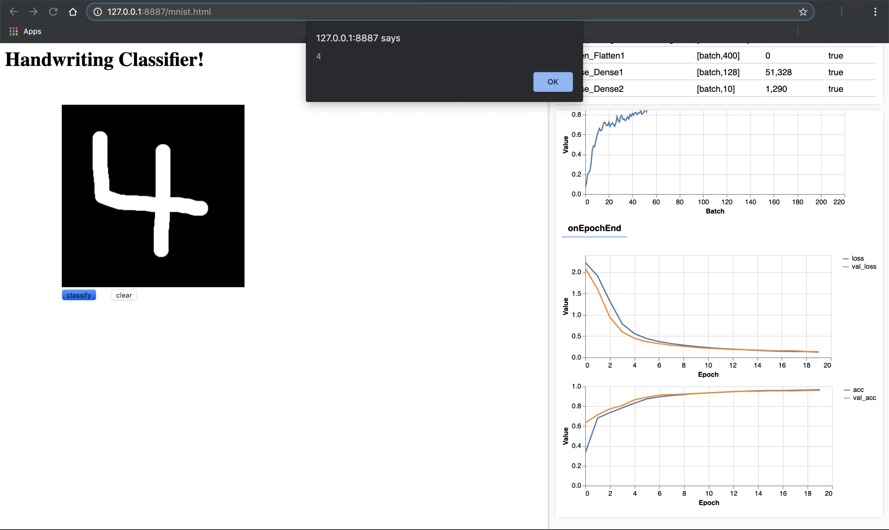

# MNIST Classifier

We will create a neural network that can classify the images of handwritten digits from the MNIST dataset.

Lab 1: [tensorflow-2-public/C1_Browser-based-TF-JS/W2/ungraded_lab/](../../tensorflow-2-public/C1_Browser-based-TF-JS/W2/ungraded_lab/)

When you launch the C1_W2_Lab_1_mnist.html file in the Chrome browser (using the Web Server), tfjs-vis will automatically display the model architecture and the training progress. Once training has finished, you can draw digits on the black rectangle to be classified. After drawing a digit, and pressing the "classify" button, the code will alert the predicted digit. As you can see below, in this particular example, the predicted digit is a 4.

      
    <i>Images 7 MNIST Classifier</i>

