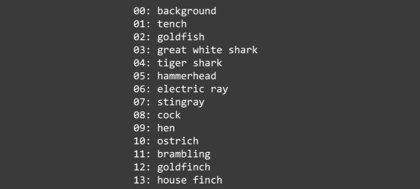

# Converting Models to JSON Format

We'll learn how to take a model that's been trained in TensorFlow in Python and run that in a web browser, in TensorFlow.js.

## Toxicity Classifier
We will use the [pre-trained toxicity model](https://github.com/tensorflow/tfjs-models/tree/master/toxicity) to detect whether a given piece of text contains toxic contenct such as threatening language, insults, obscenities, identity-based hate, or sexually explicit language. You can access the file here:

[tensorflow-2-public/C1_Browser-based-TF-JS/W3/ungraded_labs/](../../tensorflow-2-public/C1_Browser-based-TF-JS/W3/ungraded_labs/)

## Image Classification using MobileNet
Another image classification library is called MobileNet. MobileNet is a small low-latency, low-power model, parameterized to meet the resource constraints of a variety of use cases. There are several versions but they can be built upon for classification, detection, embeddings, and other segmentation similar to how other popular large-scale models, such as Inception are used. MobileNets trade-off between latency, size, and accuracy while comparing favorably with popular state of the art models. MobileNets are trained to recognize a thousand classes.

      
    <i>Images 1 MobileNet Classes Example</i>

In the next example, we will use the pre-trained MobileNet model to classify images in the browser. Acces the file here:

[tensorflow-2-public/C1_Browser-based-TF-JS/W3/ungraded_labs/](../../tensorflow-2-public/C1_Browser-based-TF-JS/W3/ungraded_labs/)

The probabiities don't all add up to one because there are 1,000 classes and the probability values for all 1,000 classes will add up to one. But to save time, this model just returns the top three.

      
    <i>Images 2 MobileNet Identifier Example</i>

## Converting Models to JSON Format
### **Linear Model**
In the next example, we will train a linear model in Python and then convert it into JSON format using the TensorFlow.js converter.

Open the C1_W3_Lab_3A_linear_to_JavaScript.ipynb Jupyter notebook found in the following folder:
[tensorflow-2-public/C1_Browser-based-TF-JS/W3/ungraded_labs/](../../tensorflow-2-public/C1_Browser-based-TF-JS/W3/ungraded_labs/)

## Reference
* Pre-trained TensorFlow.js Models: https://github.com/tensorflow/tfjs-models
* Toxicity Classifier: https://github.com/tensorflow/tfjs-models/tree/master/toxicity
* List of the classes supported by MobileNet: https://github.com/https-deeplearning-ai/tensorflow-2-public/blob/main/C1_Browser-based-TF-JS/Misc/labels.txt

