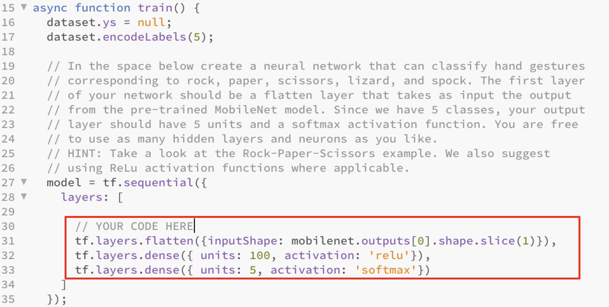
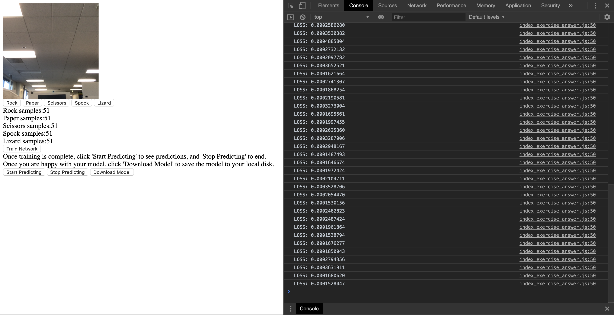
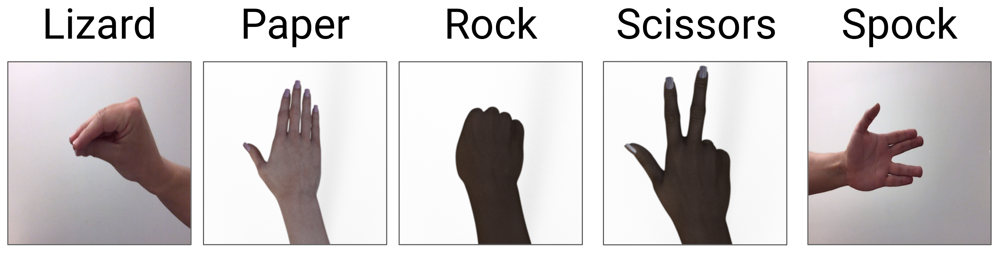
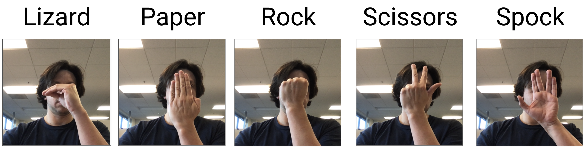

# Rock, Paper, Scissors, Lizard, Spock.

In this week's exercise, you will train your model in the browser using your webcam. You will train your model in exactly the same way as in the Rock, Paper, Scissors example but now you will include the Lizard and Spock hand gestures. Note: In this exercise, it can be a bit tricky to train a model well. So, don't get frustrated if you don't get it right the first time. 

The C1_W4_Assignment.js file can be found in the following folder

[tensorflow-2-public/C1_Browser-based-TF-JS/W4/assignment/](../../../../tensorflow-2-public/C1_Browser-based-TF-JS/W4/assignment/)

Below are a few tips that can help you get started.

1. To prevent overfitting do not add a lot a of dense layers. Using the same layers as in the Rock, Paper, Scissors example should be good enough. 
    

          
    

2. Collecting between 50 to100 images for each hand gesture should be good enough for most models. However, feel free to experiment and try to train your model with less or more images. 
3. Wait until Training has Finished before you Download the Model. To make sure training has completed, open the Developer Tools and look at the Console output. When the browser alerts that "Training is Done!" click Ok. After you click Ok, you will see the value of the LOSS being printed in Console. Once the LOSS values stop being printed, you can go ahead and click the "Download Model" button to download the model and its weights.
    

          
    

4. Your model will be graded based on how it performs on our test set. Below are a couple of images from our testing set:
    

          
    

5. To train your model, don't stand too far away from the webcam and it's much better if you do not wear sleeves. Below are some sample training images.
    

          
    

## Possible Issues
Because some of the weights of your model are initialized randomly, your model might get stuck in a local minima during training. When this happens your model may not perform optimally and may cause your submission to fail. If you are confident you did everything  correctly and your submission didn't pass, try re-training the model and re-submitting it. 