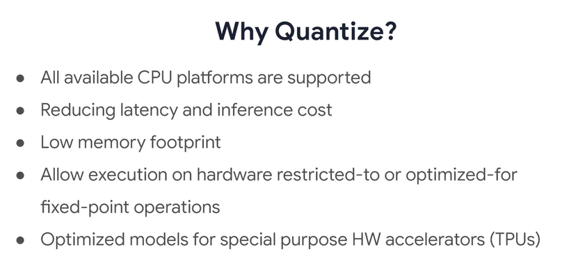

# Device-based Models with TensorFlow Lite

## Features and Component of mobile AI
These are some features for a mobile AI platform.

      
    <i>Image 1. Mobile AI Platform Features</i>

You may have heard of mobile models like mobile nets and how they're designed for the mobile platform. 
* Lightweight, working on small low power devices like phones (may be not accurate as those which run on supercomputers in the cloud)
* Low latency, Tensorflow Lite is a solution designed run on the devices with low latency and without the need for an internet connection
* Privacy, since TFLite uses on-device ML to operate, there's absolutely no need for data to leave the device in sharing your privacy
* Improve power consumption, as network connections can tend to be very power-hungry
* Efficient model format, Models in TFLite are designed to have a small binary size with just a minor impact on accuracy.
* Pre-trained models, TensorFlow Lite has just about everything you need for the most common machine learning tasks, as well as sample examples that you could try out just to see how a model would run on a mobile device

To accomplish some of the other tasks, TensorFlow Lite comes with a utility that helps you convert TensorFlow models from their various formats into a special format that's consumable by TensorFlow Lite.

      
    <i>Image 2. Components in TensorFlow Lite</i>

TensorFlow Lite comprises of two main components; a converter, and an interpreter.
* Converter can be used for creating a TFLite model from various model formats and it runs on your model development and training environment
* Interpreter, which runs on mobile device, is responsible for executing these models and client applications using a reduces set of TensorFlow's operators. It uses a custom memory allocator, which is less dynamic to ensure minimal load, initialization, and execution latency. It also provides support for a wide range of devices both in mobile and IoT along with their hardware accelerated APIs.

## Architecture and Performance
Once you've trained model, it has to go through a process of conversion before it can be used on a device

      
    <i>Image 3. Architecture</i>

Once you have it you'll use the tensorflow lite converter tools to flatten the model to prepare it for mobile or embedded devices.

      
    <i>Image 4. Performance</i>

Running inference on compute heavy machine learning models on mobile devices is resource demanding due to a device has limited processing and power. So inference on these devices has to be performed very quickly to avoid overhead and make real-time applications possible. For this purpose tensorflow lite can employ Hardware acceleration libraries or APIs for supported devices. 

One way to improve inference on Android devices is by leveraging Androids neural network API.

Secondly inference can be boosted with Edge TPUs use as their solely built for operating on deep learning models. This is not just limited to serving models, but also to training them they're also known to be high performing and have a low-power footprint while being pretty small in size.

      
    <i>Image 5. TensorFlow Lite Delegates</i>

Another form of acceleration which comes in tensorflow lite is a tensorflow lite delegate which is a way to pass your graph execution to Hardware that's specialized to run inference.

## Optimization Techniques
It's critical that deployed machine learning models have optimal model size, low latency and power consumption.  It's critical that deployed machine learning models have optimal model size low latency and power consumption.

      
    <i>Image 6. Techniques</i>

Several methods that one can use to achieve these types of optimizations:
* Quantization, reduces the precision of the numbers in the weights and biases of the model (we will focus on this one)
* Weight pruning, reduces the overall number of parameters
* Model topology transforms whose goal is to convert the overall model topology to get a more efficient model to begin with

### Quantization
Quantization optimizes your model with reduced precision representations of weights and optionally activations for both storage and computation.

      
    <i>Image 7. Quantization</i>

### TF Lite Workflow

      
    <i>Image 8. TF Lite Workflow</i>

The workflow:
1. Start with an existing model and convert it for TF Lite (or you may even have a model that's already optimized)
2. You can take your custom models and TF lite too, converting them and then optimizing them for mobile performance.

## Saving, Converting and Optimizing a Model
In summary, the process you'll go through looks a little bit like this. 

      
    <i>Image 9. Process</i>

You'll train a model with TensorFlow and then save it as a Saved Model. You'll use the TFLite converter with it to then produce a TFLite model. 

### What is converter?
When you create a model with TensorFlow using the Keras APIs or with the low-level APIs, you'll save it out as a Keras model, a SavedModel or a set of concrete in-memory functions.

      
    <i>Image 10. TensorFlow Lite Converter</i>

The converter takes these and converts to the .TFlite formats which is a flat buffer that can then be used on the mobile device along with optional back ends like the neural network APIs or GPUs.

      
    <i>Image 11. Parameters for Conversion</i>

Depending on how your model is represented, you can then instantiate it from the SavedModel, from the Keras model, or from the concrete functions in order to get an output.

      
    <i>Image 12. Saved Model</i>

The preferred standard methodology for saving models in TensorFlow 2.0 is the SavedModel format. With SavedModel, you can forget the code that was originally used for building the model rendering models to be shared and deployed easily with TensorFlow Lite, TensorFlow.js, TensorFlow Serving, and TensorFlow Hub.

To understand the interfaces of signatures of a SavedModel, we can call the SavedModel CLI script and get details about it with code like this.

      
    <i>Image 13. Saved Model CLI</i>

      
    <i>Image 14. Saved Model Result</i>

For example, here, we can see that this model expects images to be input as 224 by 224 by 3. In other words, 24-bit color, 224 by 224 and their output is of shape 1,000 which tells me that it's classifying up to 1,000 classes.

      
    <i>Image 15. Exporting Saved Model</i> 

You can notice there's a safe path convention being followed which is used by TensorFlow Serving where the last path components, in this case, the number one is a version number for your model.

## Saved Model Format Examples
### Example 1
The simplest possible neural network is one that has one layer and that layer has one neuron.

      

      
    <i>Image 16. Example 1</i> 

* First, save it as a saved model. Do this with the ``saved_model.save`` method
* Instantiate the ``TFLiteConverter`` from that saved model. After that, call the convert method and get the flattened version of the model
* Save out the TFLite file by writing it to the file system

We now have a model that can be deployed to Android, iOS, or Edge systems.

### Example 2 - Preexisting model
For example we want to use a MobileNetV2 model that has been created before.

      
    <i>Image 17. Example 2</i> 

* First, will be to load the model from ``tf.keras.applications`` initializing it with the weights that want be used. As it's a Keras model, we can save it in the H5 Keras formats with ``model.save``.
* Instantiate the TFLiteConverter using from Keras model and then convert it
* Then saving the model in TF Lite format is exactly the same as before. Simply write the bytes of the converted TF Lite model to the file system.

### Command Line Usage

      
    <i>Image 18. Command Line Usage</i> 

If you don't have access to the Python code for generating the model, but you do have the saved model file, then the converter also works on the command line. So if it's in saved model formats, you simply call ``tflite_convert`` and specify that your model is in a path using the saved model directory switch. If it's in Keras H5 format, you use the Keras model files switch instead.

## Quantization
Instead of quantizing a model during training and effectively changing your training code, you instead quantize as part of the process of converting the model to the TF-lite format. At its simplest, it converts all the floats in the weights of the model into ints. 

      
    <i>Image 19. Quantization</i> 

The default behavior of the converter is to optimize for both size and latency, but you can override this in code. You could also specify that you want to optimize for latency for improved performance or just leave it at the default where the converter will try to figure out the best balance between size and latency. 

      
    <i>Image 20. Post Training Quantization</i> 

In some cases, for example, with Edge TPUs, the accelerators use only integers. For this, the optimization toolkit allows you to do post-training integer quantization, which makes models up to four times smaller. 

      
    <i>Image 21. Post Training Integer Quantization</i> 

You can then further optimize by using calibration data where you run inference on a small set of inputs so as to determine the right scaling parameters to use when converting a model for integer quantization. Here's an example of converting a SavedModel to TensorFlow Lite with post-training integer quantization.

      
    <i>Image 22. Post Training Integer Quantization</i> 

* Define a generator which is designed to generate samples from datasets. 
* Set the default optimization mode where it balances size in latency.
* Pass our generator to the TF Lite converter as a representative data set. A representative data set is used for evaluating optimizations by recording dynamic ranges.

      
    <i>Image 23. Full-integer Quantization</i> 

If you have ops that don't have quantized implementations, their floating values will be used automatically. This makes for conversions to occur smoothly while restricting deployments as special purpose accelerators that only support integers. So to support these devices that do not support floating point operations, we just tell the converter to only output integers, and this can be done by constraining the quantization target specification to TensorFlow lights INT eight built-in ops. Do note that if the converter comes across an operation which cannot be currently quantized, an error may be raised.

## TF-Select
Conversion can sometimes be harder as you might come across some problems with unsupported TensorFlow Ops while converting your models with the TF lite converter. This means the framework supports a limited number of TensorFlow operations used in common inference models as that process by the Tensorflow lite optimizing converter. Since the set of TensorFlow lite operations is smaller than TensorFlow's regular C++ Ops, not every model is convertible. 

In the model conversion process, Those unsupported Ops can come off as point of friction. While TensorFlow lite will continue to have the built-in Ops optimized for mobile and embedded devices, now it's possible to use a subset of the TensorFlow Ops when the built-in ones do not suffice. With TF select, you can do this, keeping in mind that a small bulk will be added to your model's. size we'll look at that next.

      
    <i>Image 24. TF-Select</i> 

It's a small modifications are how you convert your models TF lite. This is pretty much the same code you'd use for normal conversions to TemsorFlow lite. The only difference here is that you specify Target Ops to also include the set of TensorFlow Select Ops.

## Paths in Optimization

This is a summary of the paths you're likely to follow when optimizing your TF Lite models. If you don't intend to quantize your model, you'll be ending up with a floating point model. However, if you do wish to quantize only the weights in the model, you can do so just by setting one of the post-training optimization modes in the converter. 

      
    <i>Image 25. Paths in Optimization</i> 

The converter will do its best to quantize all the ops, but your model may still end up with a few floating point ops. This optimization provides latencies close to fully fixed point inference. We can further get latency improvements by quantizing both the weights and activations with a representative dataset. On a side note, at times you may not have access to a representative dataset, and you don't have to worry too much about it as you can get along just fine without it by having a model that has some floating point ops. Later, if you wish to have the model only output integers, a quantization target specification can be set in the converter to generate a model with quantized ops. But if all else fails and you're encountering errors in this procedure, then you might have to use TF select to obtain a model with as many ops as possible. 

      
    <i>Image 26. TF LIte Interpreter</i> 

One really nice feature is the ability to test your model using Python on your developer workstation so you don't need to deploy it to a mobile and embedded system before you can start using it. You'll start by loading your TensorFlow Lite model and allocating tensors like this. Then we'll extract the input and output tensors for the model. We can then set the input tensor with some valid data and invoke the interpreter to run inference on it before reading the results by looking at the output tensor

## Running the Models

      
    <i>Image 27. Running Models</i> 

There's typically two ways that you can get models. For each of these, you can convert the model into TFLite so you're covered
1. Pre-trained model. The TensorFlow Keras APIs have a number of them built in for things like image classification and object detection. There's also a repository called TensorFlow Hub where models can be shared between developers
2. Build a custom model

      
    <i>Image 28. Basic Model Running</i> 

Here are the steps:
1. Using TensorFlow to build and train model. This is done on developer workstation or cloud environment typically in Python
2. Save model and convert it to the TFLite format
3. Verify model. It can be done in Python on developer workstation before deploying it to mobile.
4. Deploy by putting the TFLite file in app code in Android, iOS or other system typically as a resource.

When we deploy it to a simple app, the inference can run on the device. 

## References
* GPU Delegates: https://www.youtube.com/watch?v=QSbAUxWfxQw
* Supported ops: https://www.tensorflow.org/lite/guide/ops_compatibility
* TF-Select: https://www.tensorflow.org/lite/guide/ops_select